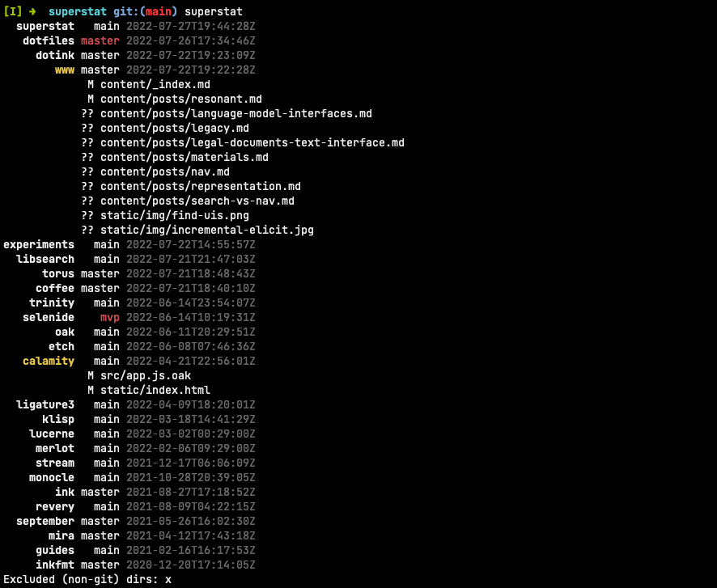
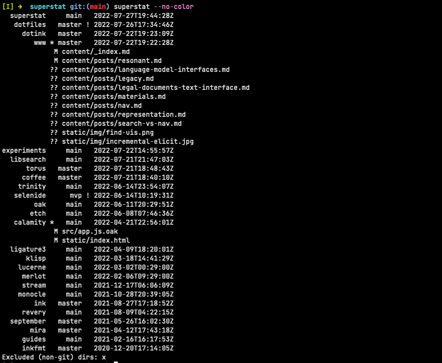
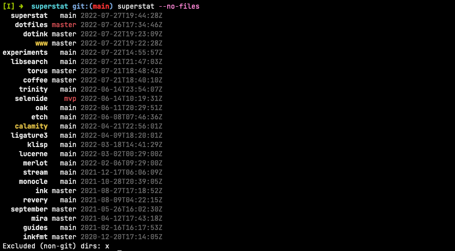

# Git `superstat` 🎡

I, like a lot of developers, put all my git repositories in a single folder on my computer. (For me, that's `$HOME/src`.) Sometimes my work leads me to making changes in a few different repositories on my machine during a single work session, and I often want to answer the question:

>What are all the projects I just made changes in, and what un-pushed changes are in each?

**Superstat** is a tool I wrote to answer that question quickly and concisely. It runs **git status + diff across every git repository in a folder**, and presents a nice visual summary, like this:



Each line has the format `repo | branch | date-when-I-last-worked-on-it`, followed potentially by a list of files with un-committed changes. The repo name is _yellow_ if it has non-committed changes, and the branch name is _red_ if it has commits that haven't been pushed upstream.

## How to use `superstat`

Typing `superstat --help` tells us the following:

```
Superstat: git status + diff every repo in a workspace.

Usage
	superstat [rootDir] [options]

Options
	--[h]elp      Show this help message
	--[v]ersion   Print version information and exit
	--no-[c]olor  Use letters instead of colors to indicate info
	--no-[f]iles  Do not list non-committed file changes

Legend
	[repo-name] [branch] [last-worked-on-timestamp]
	            [non-committed-changes]

	- repo-name is yellow (or followed by "*") if there are non-committed
	  changes.
	- branch is red (or followed by "!") if there are unsynced changes (if
	  local is ahead of remote).
	- If no rootDir is provided, Superstat falls back to $SUPERSTAT_ROOT
	  if defined in the environment.
```

If you keep all your git repositories in `~/workspace/`, for example, a basic usage looks like:

```sh
superstat ~/workspace
```

You can also set the `SUPERSTAT_ROOT` environment variable to your git-repository folder to save yourself some typing every time you use Superstat:

```sh
# somewhere in your ~/.profile or ~/.bashrc
export SUPERSTAT_ROOT=~/workspace

# later, in your shell
superstat
```

Here are what the `--no-color` and `--no-files` options look like. When using `--no-color`, instead of using text color to indicate each repo's status, Superstat uses little characters `*` and `!`.



The `--no-files` option simply hides the lists of files with non-committed changes, for a more concise view that just shows which repos may need your attention.



## Install

If you have [Oak](https://oaklang.org) installed, you can build from source (see below). Otherwise, I provide pre-built binaries for macOS (x86 and arm64) and Linux (x86) on the [releases page](https://github.com/thesephist/superstat/releases). Just drop those into your `$PATH` and you should be good to go.

## Build and development

Superstat is built with my [Oak programming language](https://oaklang.org), and I manage build tasks with a Makefile.

- `make` or `make build` builds a version of Superstat at `./superstat`
- `make install` installs Superstat to `/usr/local/bin`, in case that's where you like to keep your bins
- `make fmt` or `make f` formats all Oak source files tracked by Git
